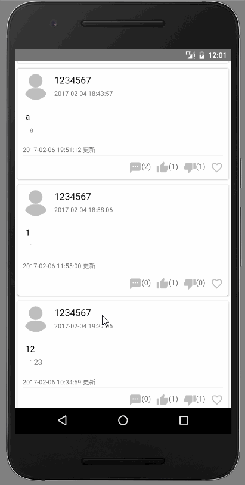
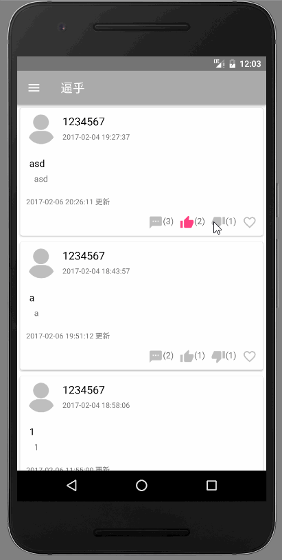
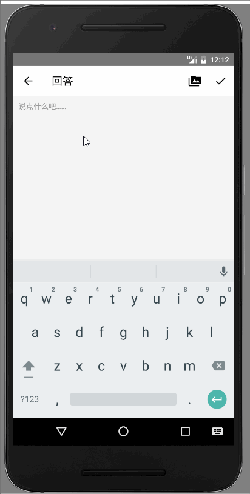
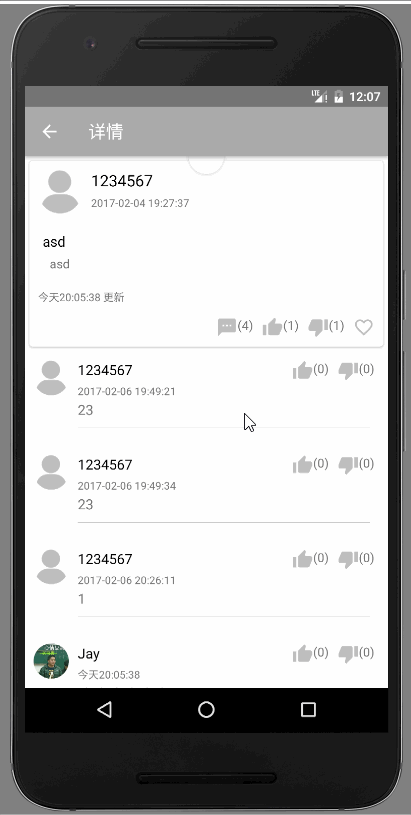
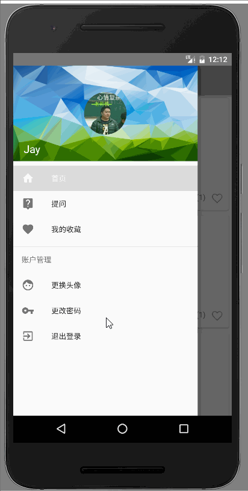
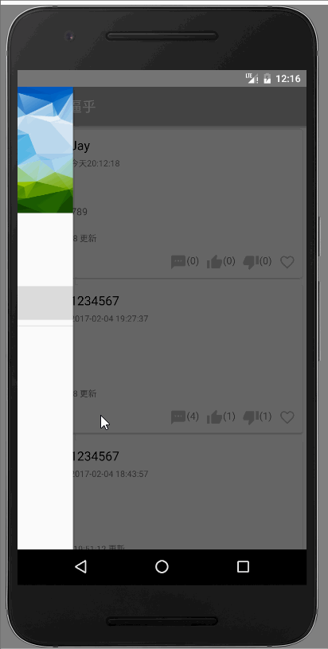

<h1>逼乎<h1>

重庆邮电大学红岩移动开发部Android学员2017年寒假考核作业

<h2>应用简介</h2>

这是重庆邮电大学红岩移动开发部Android学员2017寒假考核作业lv3 
实现了API里的所有功能，具体功能：<a href="https://github.com/haruue/bihu_web/blob/master/api.md" target="_blank">click me</a>

<h2>功能展示</h2>
<ul>
	<li>
		<h3>登录、登出</h3>
		
	</li>

	<li>
		<h3>加载、刷新问题列表</h3>
		
	</li>

	<li>
		<h3>exciting、naive、收藏</h3>
		
	</li>

	<li>
		<h3>回答、采纳</h3>
		
	</li>

	<li>
		<h3>回答列表</h3>
		
	</li>

	<li>
		<h3>提问</h3>
		
	</li>

	<li>
		<h3>收藏列表</h3>
		
	</li>

	<li>
		<h3>更改头像</h3>
		
	</li>

	<li>
		<h3>更改密码</h3>
		
	</li>
</ul>

<h2>APP下载</h2>
<ul>
	<li><a href="https://raw.githubusercontent.com/l1432562823/BiHu/master/app/app-release.apk">点击下载</a></li>
</ul>

<h2>开发者</h2>

Jay Li
